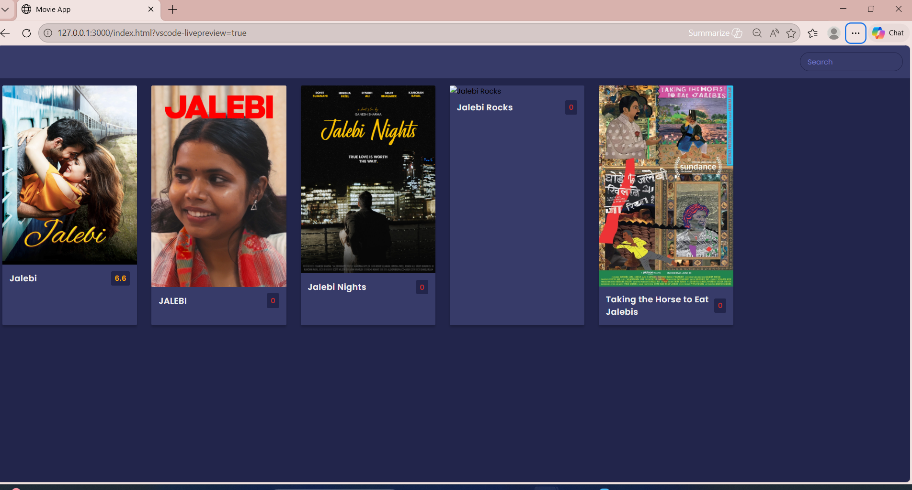
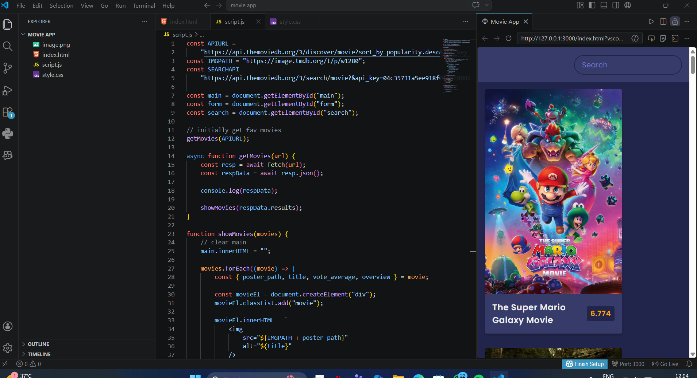

# 🎬 Movie Recommendation Website

A simple and interactive Movie Recommendation Website built using **HTML, CSS, and JavaScript**.  
This project allows users to explore and get movie suggestions based on predefined data and logic.

---

## 🚀 Features

- 🎥 Browse movies easily  
- 🔍 Search for your favorite movies  
- ⭐ Get movie recommendations  
- 💻 Clean and responsive user interface  
- ⚡ Fast and lightweight (no backend required)

---

## 🛠️ Tech Stack

- HTML  
- CSS  
- JavaScript  

---

## 🧠 How It Works

This project uses **JavaScript logic** to recommend movies based on predefined datasets or conditions.

- Movies are stored in arrays / JSON format  
- User input is taken from search or selection  
- JavaScript filters and matches relevant movies  
- Results are displayed dynamically on the UI  

---

---

  

  

